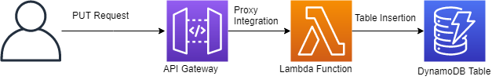

# Mobile-Info-Store-AWSLambda-Kotlin

## What Is AWS Lambda
AWS Lambda is a serveless computing plataform that allows the development of any type of application or backend service without the need to provision servers.

### AWS Lambda Anatomy

* **Handler**

The handler is the entry point for the lambda. A lambda function accepts JSON formatted input

* **Runtime Environment** 

A lambda function need to have a runtime environment configured

* **Trigger**

The invocation of a lambda function must be the response to an event (respond to requests AWS API Gateway)

---
Terminology

**Fat Jar (Uber Jar):** The fat jar is the jar, which contains classes from all the libraries, on which your project depends and, of course, the classes of current project.

---

### Creating a Lambda with Kotlin
1. Build the Lambda Uber Jar with:

`./gradlew clean build <nameProject>`

